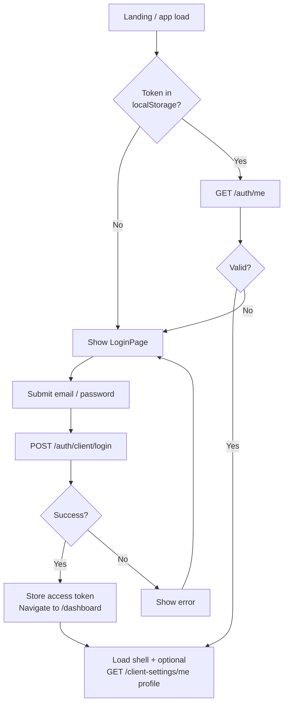
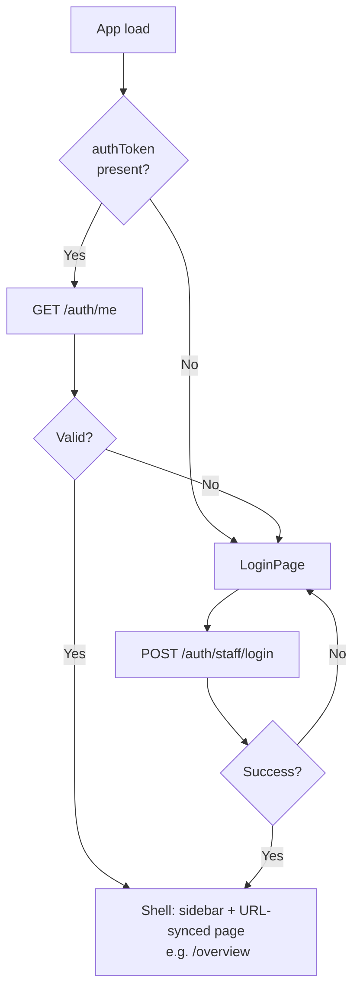
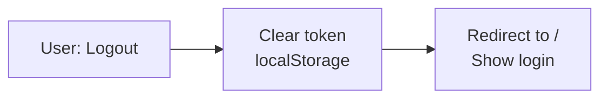
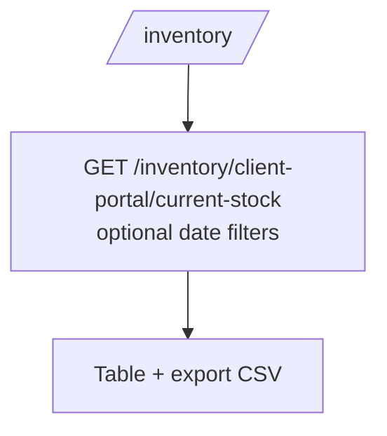
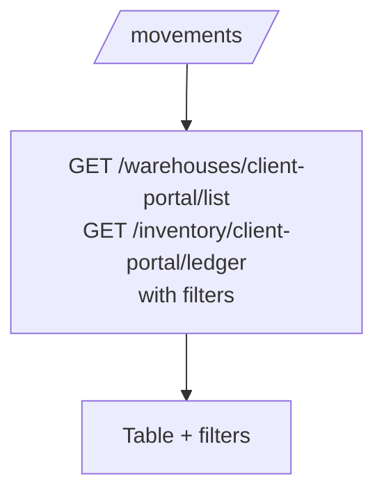
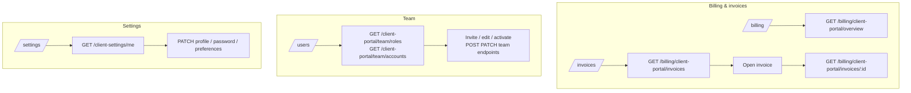
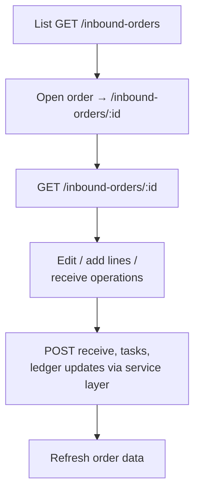
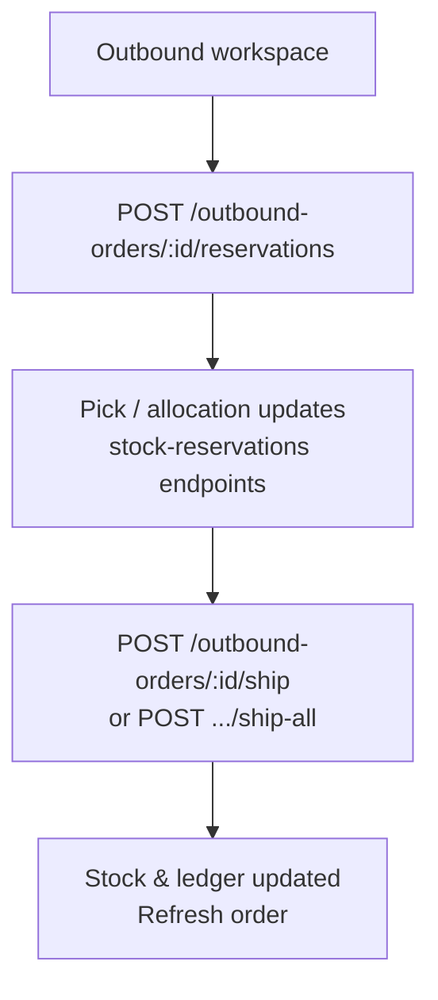
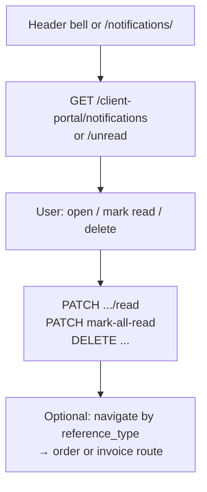
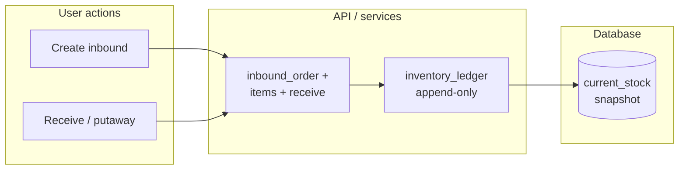

# User flow diagrams — Emdad 3PL WMS

This document describes **user-facing flows** for the React apps in `ClientFinal/` and how they relate to the NestJS API. Diagrams use [Mermaid](https://mermaid.js.org/); render them in GitHub, VS Code (Mermaid preview), or any Markdown viewer that supports Mermaid.

---

## 1. Actors and applications

```mermaid
flowchart LR
  subgraph actors["Users"]
    CU[Client portal user\n(ClientAccount)]
    SU[Staff / internal user\n(User + Actor)]
  end

  subgraph apps["Frontends"]
    CP[Client portal\nReact + Vite]
    AD[Admin console\nReact + Vite]
  end

  subgraph api["Backend"]
    API[NestJS API\nJWT Bearer]
    DB[(PostgreSQL)]
  end

  CU --> CP
  SU --> AD
  CP --> API
  AD --> API
  API --> DB
```

---

## 2. Authentication flows

### 2.1 Client portal login



### 2.2 Staff (admin) login



### 2.3 Logout (both apps)



---

## 3. Client portal — primary navigation

After login, the user moves between **routes**; the shell provides sidebar navigation and header (search UI is present but not wired to an API in current code).

```mermaid
flowchart TB
  subgraph shell["Authenticated shell"]
    SB[Sidebar: Dashboard, Inventory,\nMaster data, Orders, Movements,\nReports, Billing, Invoices, Users]
    HDR[Header: notifications dropdown,\nprofile → Settings / Logout]
  end

  SB --> D[/dashboard/]
  SB --> I[/inventory/]
  SB --> MD[/master-data/\n→ Products tab]
  SB --> O[/orders/]
  SB --> M[/movements/]
  SB --> R[/reports/\nmostly UI-only]
  SB --> BIL[/billing/]
  SB --> INV[/invoices/]
  SB --> U[/users/\nTeam]
  HDR --> SET[/settings/]
  HDR --> N[/notifications/]
```

---

## 4. Client portal — create order (inbound or outbound)

```mermaid
flowchart TD
  A[Orders list] --> B[Tap Create inbound / outbound]
  B --> C[Route:\n/orders/create/inbound|outbound]
  C --> D[GET /products/client-portal/list\n+ build line editor]
  D --> E[User: expected date,\nadd lines product + qty]
  E --> F[Submit]
  F --> G{Inbound?}
  G -->|Yes| H[POST /inbound-orders/client-portal]
  G -->|No| I[POST /outbound-orders/client-portal]
  H --> J[POST .../client-portal/:orderId/items\nper line]
  I --> J
  J --> K[Navigate back to /orders]
```

---

## 5. Client portal — view order detail

```mermaid
flowchart TD
  A[Orders list] --> B[Open row / detail]
  B --> C[Route:\n/orders/inbound|outbound/:orderRef]
  C --> D{Type}
  D -->|Inbound| E[GET /inbound-orders/client-portal/detail?ref=]
  D -->|Outbound| F[GET /outbound-orders/client-portal/detail?ref=]
  E --> G[Render order + lines]
  F --> G
  G --> H[Back → /orders]
```

---

## 6. Client portal — inventory & movements

### 6.1 Current stock



### 6.2 Movements (ledger)



---

## 7. Client portal — billing, invoices, team, settings



---

## 8. Staff (admin) — navigation model

The admin app uses **URL segments** synced to a single large view (no React Router route tree). Main areas:

```mermaid
flowchart TB
  L[Login] --> O[Authenticated shell]

  O --> OV[/overview/\nGET /dashboard/overview]
  O --> WM[/work-management/\nGET /task-work-orders]
  O --> IA[/identity-access/\nGET /users, roles]
  O --> MD[/master-data/\nclients, products, warehouses,\nlocations, UOM]
  O --> INB[/inbound-orders/\nlist → /inbound-orders/:id workspace]
  O --> OUT[/outbound-orders/\nsame pattern]
  O --> INV[/inventory/\nGET /inventory/current-stock\n→ ledger /inventory/ledger/:id?]
  O --> ADJ[/adjustments/\nGET/POST /adjustments]
  O --> RET[/returns/\nGET /return-orders]
  O --> REP[/reports/\nmostly static UI + /reports/:type]
  O --> BIL[/billing/\nGET /billing/plans ...]
  O --> VAS[/value-added-services/\nGET /vas]
  O --> APR[/approvals/\nGET/POST /approvals]
```

---

## 9. Staff — inbound order workspace (conceptual)



---

## 10. Staff — outbound: reserve → ship



---

## 11. Notifications (client portal)



---

## 12. End-to-end — goods receipt to available stock (system-level)

User actions drive services that write **ledger**; **current_stock** is derived (triggers / rules in DB).



---

## Notes

- **Reports** (client `/reports` and admin report sub-pages) are largely **not backed** by dedicated report-generation APIs in the current codebase; flows stop at the UI or static data.
- **Token refresh**: backend exposes `POST /auth/refresh`; frontends may still rely on re-login when access tokens expire.
- **Search** fields in headers are **not** connected to a global search API in the current frontends.

For API-level detail see `server/BACKEND_DOCUMENTATION.md`; for UI routes see `ClientFinal/FRONTEND_DOCUMENTATION.md`.
